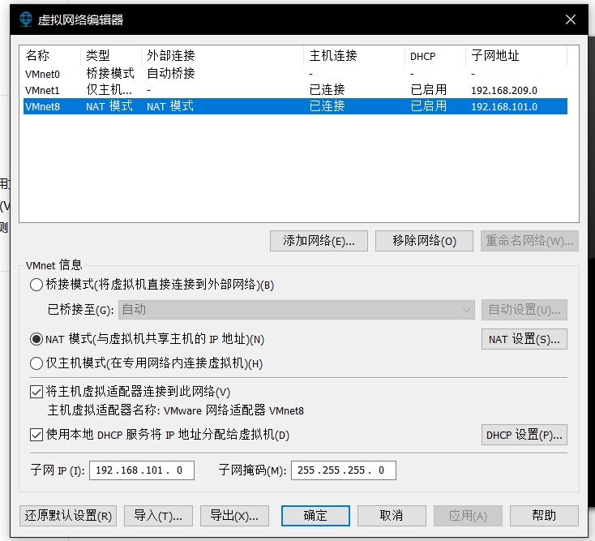
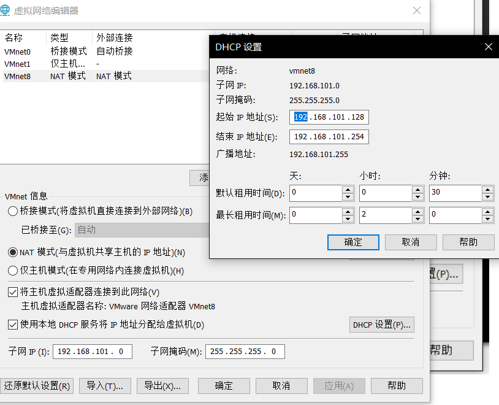
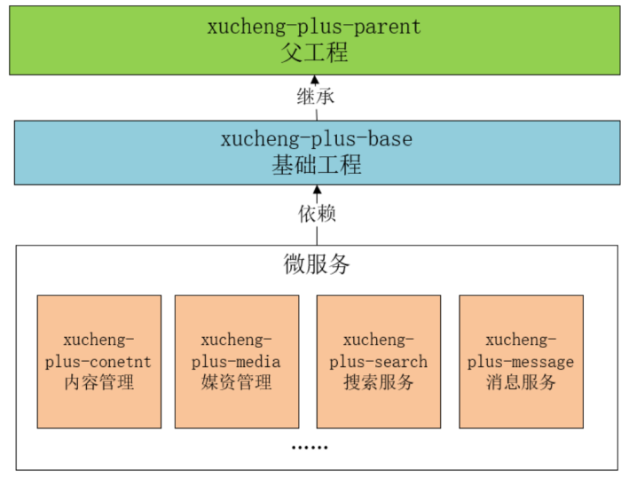
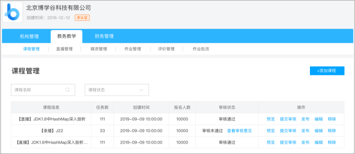

# 学成在线学习笔记

# 一 前言

项目开始前介绍需要准备的工具。

**centos 7的登录账号：root/centos**

**虚拟机ip地址：192.168.101.65**

**mysql的登录账号：root/mysql**

注意：

虚拟机连接网络时需要，设置好NAT 8的子网地址，将其改为192.168.101.0

# 二 开始

## 1、父工程

父工程不写代码，只是利用其pom控制jar的版本

## 2 内容管理模块

### 2.2.1 内容管理模块做什么的？

内容管理的业务由教学机构人员和平台的运营人员共同完成。

教学机构人员可以：

1、维护课程信息，添加一门课程需要编辑课程的基本信息、上传课程图片、课程营销信息、课程计划、上传课程视频、课程师资信息等内容。

2、课程信息编辑完成，通过课程预览确认无误后提交课程审核。

3、待运营人员对课程审核通过后方可进行课程发布。

### 2.2.2 界面原型

